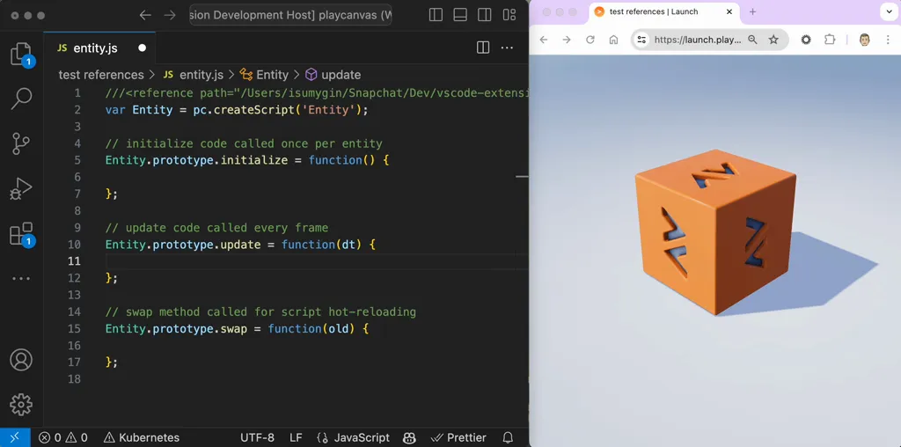
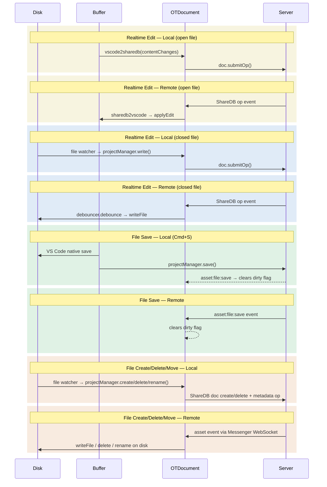

# PlayCanvas VS Code Extension

[](https://github.com/playcanvas/vscode-extension/releases)
[](https://github.com/playcanvas/vscode-extension/blob/main/LICENSE)
[](https://discord.gg/RSaMRzg)
[](https://www.reddit.com/r/PlayCanvas)
[](https://x.com/intent/follow?screen_name=playcanvas)

| [User Manual](https://developer.playcanvas.com/user-manual/editor) | [API Reference](https://api.playcanvas.com/editor) | [Blog](https://blog.playcanvas.com) | [Forum](https://forum.playcanvas.com) |

The PlayCanvas VS Code Extension is a realtime editing environment for text-based assets from the [PlayCanvas Editor](https://github.com/playcanvas/editor) platform.



## Usage

1. [Download](https://marketplace.visualstudio.com/items?itemName=playcanvas.playcanvas) the VS Code Extension from the VS Code marketplace.
2. Click the popup link to sign in with your PlayCanvas account.
3. Open the command palette (Ctrl/Cmd + P) and run the command `PlayCanvas: Open Project` to load a project.

## Compatibility

| Editor  | Supported |
| ------- | --------- |
| VS Code | ✅        |
| Cursor  | ✅        |

## Features

- Realtime file updating in VS Code
- File system operations (create/delete/rename/move)
- Integrated types with type checking
- Branch switching
- List view for currently online collaborators per file
- Ignore file support (Beta)
    - Create a file in the root of your project called `.pcignore`
    - Syntax follows `.gitignore` using file globs (e.g. `*.ts`)
    - Rules re-parse automatically on change; reload to sync files to disk

## Architecture

Data flows bidirectionally between four components: the filesystem (Disk), the VS Code editor buffer (Buffer), the OT document state (OTDocument), and the remote collaboration server (Server).



## Local Development

To initialize a local development environment for the Editor Frontend, ensure you have [Node.js](https://nodejs.org/) 18 or later installed. Follow these steps:

1. Clone the repository:

    ```sh
    git clone https://github.com/playcanvas/vscode-extension.git
    cd vscode-extension
    ```

2. Install dependencies for extension and plugin

    ```sh
    npm install
    cd plugin
    npm install
    ```

3. Run and Debug (F5) with the `Run Extension` configuration to start the extension a development environment. More information about how to develop extensions can be found [here](https://code.visualstudio.com/api/get-started/your-first-extension)

4. To test your extension switch the launch configuration to `Test Extension` to run the testing suite
