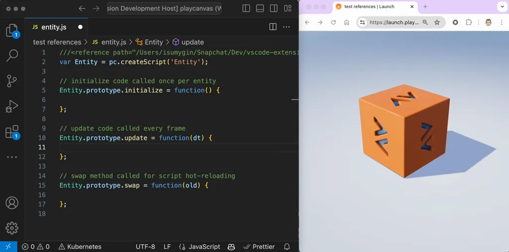
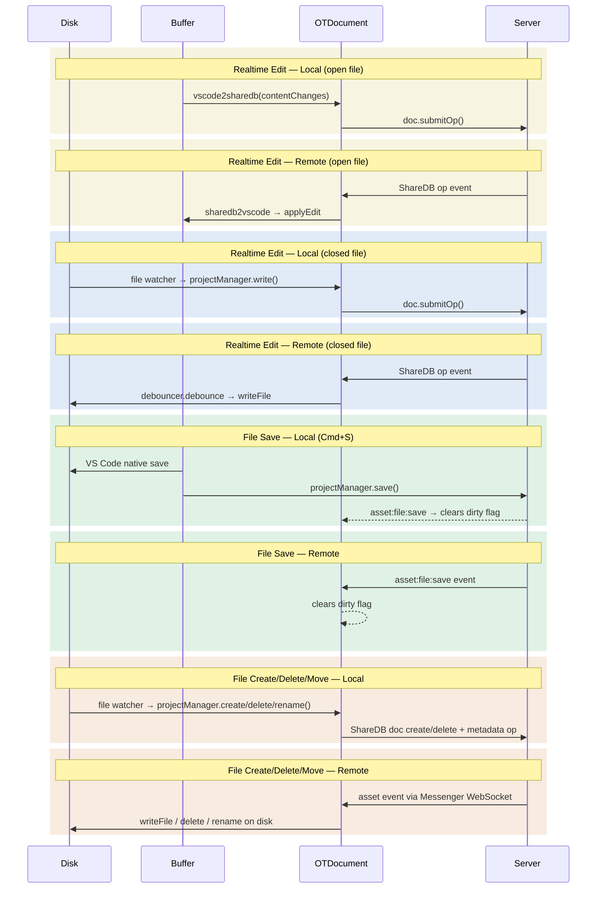
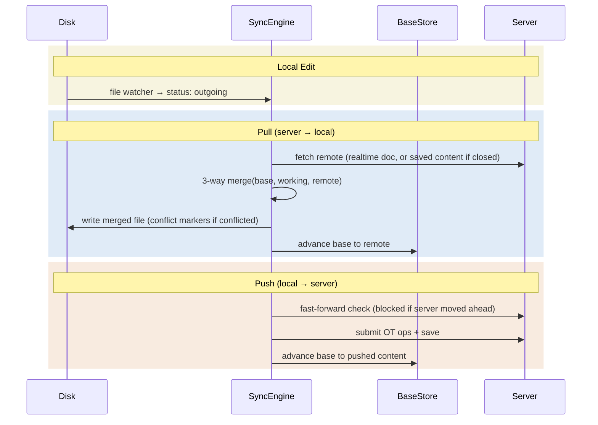

# PlayCanvas VS Code Extension

[](https://github.com/playcanvas/vscode-extension/releases)
[](https://github.com/playcanvas/vscode-extension/blob/main/LICENSE)
[](https://discord.gg/RSaMRzg)
[](https://www.reddit.com/r/PlayCanvas)
[](https://x.com/intent/follow?screen_name=playcanvas)

| [User Manual](https://developer.playcanvas.com/user-manual/editor) | [API Reference](https://api.playcanvas.com/editor) | [Blog](https://blog.playcanvas.com) | [Forum](https://forum.playcanvas.com) |

The PlayCanvas VS Code Extension is an editing environment for text-based assets from the [PlayCanvas Editor](https://github.com/playcanvas/editor) platform. Edits sync with your collaborators in realtime by default, or on demand with Git-style Pull/Push.



## Getting Started

1. [Download](https://marketplace.visualstudio.com/items?itemName=playcanvas.playcanvas) the VS Code Extension from the VS Code marketplace.
2. Click the popup link to sign in with your PlayCanvas account.
3. Open the command palette (Ctrl/Cmd + P) and run the command `PlayCanvas: Open Project` to load a project.

## Compatibility

| Editor  | Supported |
| ------- | --------- |
| VS Code | ✅        |
| Cursor  | ✅        |

## Features

- Two sync modes — realtime (default) or Git-style Pull/Push; see [Sync Modes](#sync-modes)
- File system operations (create/delete/rename/move)
- Integrated types with type checking
- Branch switching
- List view for currently online collaborators per file
- Ignore file support (Beta)
    - Create a file in the root of your project called `.pcignore`
    - Syntax follows `.gitignore` using file globs (e.g. `*.ts`)
    - Rules re-parse automatically on change; reload to sync files to disk

## Sync Modes

The extension syncs with the PlayCanvas Editor in one of two modes, set via `playcanvas.syncMode` in Settings (reload the window after changing it).

|               | Realtime (default)              | Pull/Push                                 |
| ------------- | ------------------------------- | ----------------------------------------- |
| Edits sync    | As you type                     | On demand (Push/Pull)                     |
| Conflicts     | Merged automatically            | 3-way merge, resolved in the merge editor |
| Collaboration | Live — see edits as they happen | Snapshot — you control when changes land  |
| Availability  | Native + Web                    | Native only                               |

### Realtime (default)

- Edits sync as you type — collaborators in the PlayCanvas Editor (or other VS Code sessions) see them immediately, and their edits appear live in your open files.
- Concurrent edits to the same file are merged automatically via operational transform.
- `Ctrl/Cmd + S` saves the asset in the PlayCanvas Editor.
- `Ctrl/Cmd + Z` / `Ctrl/Cmd + Shift + Z` map to `PlayCanvas: Undo` / `PlayCanvas: Redo` — collaborative undo that reverts only your own edits, never a collaborator's.

### Pull/Push

A Git-style alternative: edit locally and Pull/Push on demand instead of syncing every keystroke. Set `playcanvas.syncMode` to `pullpush` and reload — you'll get a **PlayCanvas** section in the Source Control panel and a **PlayCanvas** item in the status bar showing counts of incoming, outgoing, and conflicted files.

- Edit and save files normally — changes stay **local** (listed under **Changes**). Nothing reaches the server until you Push.
- **Push** (local → server): `Ctrl/Cmd + Alt + Up`, or the up-arrow button in the PlayCanvas SCM header.
- **Pull** (server → local): `Ctrl/Cmd + Alt + Down`, or the down-arrow button. Incoming edits show under **Incoming Changes** — for files you don't have open too.
- **Discard** a file back to its last-synced state via the discard action on it (it confirms first).
- **Conflicts** (same lines changed on both sides) land under **Merge Changes** — open the file, resolve in the merge editor or via the `<<<<<<< / >>>>>>>` markers, save, then Push.

Good to know:

- Push is **fast-forward only** — if the server moved ahead, Push is blocked; Pull first.
- Opening a file gives you its most current state.
- Switch back anytime: set `syncMode` to `realtime` and reload.

## Architecture

Data flows bidirectionally between four components: the filesystem (Disk), the VS Code editor buffer (Buffer), the OT document state (OTDocument), and the remote collaboration server (Server).

### Realtime


```mermaid
sequenceDiagram
    participant D as Disk
    participant B as Buffer
    participant OT as OTDocument
    participant S as Server

    rect rgba(200, 180, 50, 0.15)
    Note over D, S: Realtime Edit — Local (open file)
    B ->> OT: vscode2sharedb(contentChanges)
    OT ->> S: doc.submitOp()
    end

    rect rgba(200, 180, 50, 0.15)
    Note over D, S: Realtime Edit — Remote (open file)
    S ->> OT: ShareDB op event
    OT ->> B: sharedb2vscode → applyEdit
    end

    rect rgba(50, 120, 200, 0.15)
    Note over D, S: Realtime Edit — Local (closed file)
    D ->> OT: file watcher → projectManager.write()
    OT ->> S: doc.submitOp()
    end

    rect rgba(50, 120, 200, 0.15)
    Note over D, S: Realtime Edit — Remote (closed file)
    S ->> OT: ShareDB op event
    OT ->> D: debouncer.debounce → writeFile
    end

    rect rgba(50, 170, 80, 0.15)
    Note over D, S: File Save — Local (Cmd+S)
    B ->> D: VS Code native save
    B ->> S: projectManager.save()
    S -->> OT: asset:file:save → clears dirty flag
    end

    rect rgba(50, 170, 80, 0.15)
    Note over D, S: File Save — Remote
    S ->> OT: asset:file:save event
    OT -->> OT: clears dirty flag
    end

    rect rgba(210, 120, 50, 0.15)
    Note over D, S: File Create/Delete/Move — Local
    D ->> OT: file watcher → projectManager.create/delete/rename()
    OT ->> S: ShareDB doc create/delete + metadata op
    end

    rect rgba(210, 120, 50, 0.15)
    Note over D, S: File Create/Delete/Move — Remote
    S ->> OT: asset event via Messenger WebSocket
    OT ->> D: writeFile / delete / rename on disk
    end
```

### Pull/Push

In Pull/Push mode the SyncEngine mediates all server traffic. Local edits only mark files as outgoing; the BaseStore keeps the last-synced content per file, which is the merge base for Pull and the fast-forward check for Push.


```mermaid
sequenceDiagram
    participant D as Disk
    participant E as SyncEngine
    participant B as BaseStore
    participant S as Server

    rect rgba(200, 180, 50, 0.15)
    Note over D, S: Local Edit
    D ->> E: file watcher → status: outgoing
    end

    rect rgba(50, 120, 200, 0.15)
    Note over D, S: Pull (server → local)
    E ->> S: fetch remote (realtime doc, or saved content if closed)
    E ->> E: 3-way merge(base, working, remote)
    E ->> D: write merged file (conflict markers if conflicted)
    E ->> B: advance base to remote
    end

    rect rgba(210, 120, 50, 0.15)
    Note over D, S: Push (local → server)
    E ->> S: fast-forward check (blocked if server moved ahead)
    E ->> S: submit OT ops + save
    E ->> B: advance base to pushed content
    end
```

## Local Development

To initialize a local development environment for the Editor Frontend, ensure you have [Node.js](https://nodejs.org/) 18 or later installed. Follow these steps:

1. Clone the repository:

    ```sh
    git clone https://github.com/playcanvas/vscode-extension.git
    cd vscode-extension
    ```

2. Install dependencies for extension and plugin

    ```sh
    npm install
    cd plugin
    npm install
    ```

3. Run and Debug (F5) with the `Run Extension` configuration to start the extension a development environment. More information about how to develop extensions can be found [here](https://code.visualstudio.com/api/get-started/your-first-extension)

4. To test your extension switch the launch configuration to `Test Extension` to run the testing suite
